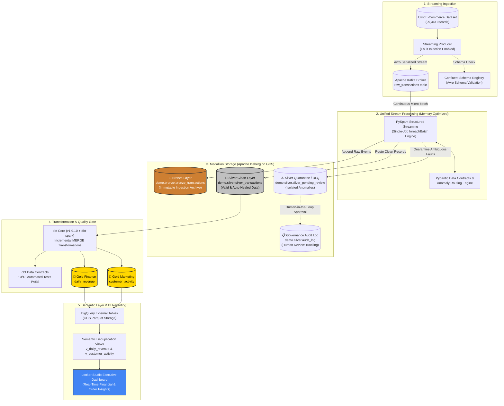
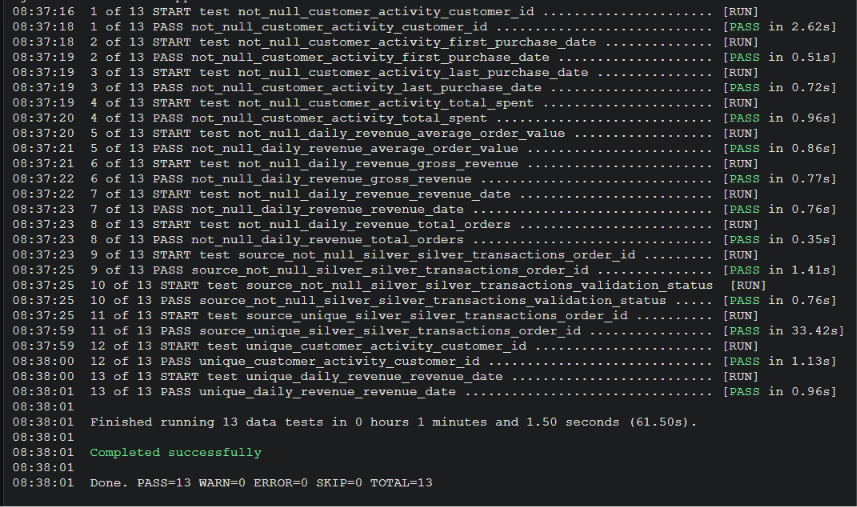
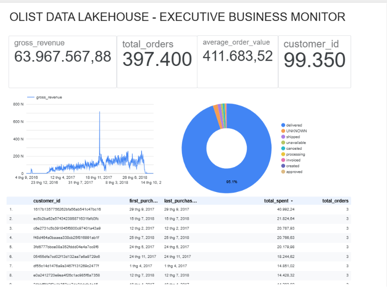

# 🌊 V2.5 Enterprise Streaming-Ingest Lakehouse
### *End-to-End Real-Time Ingestion, ACID Table Format, Automated Data Contracts & BI on GCP*

[](https://spark.apache.org/)
[](https://kafka.apache.org/)
[](https://iceberg.apache.org/)
[](https://www.getdbt.com/)
[](https://cloud.google.com/)
[](https://lookerstudio.google.com/)
[](https://www.terraform.io/)
[](https://docs.pydantic.dev/)

---

## 📌 Executive Summary

This project is a **production-structured, real-time Streaming-Ingest Lakehouse** designed and built by me to ingest, cleanse, govern, and model **99,441 e-commerce transactions** (the Brazilian Olist dataset) into an ACID Lakehouse.

What makes this project unique is my **strict resource engineering**: the entire streaming pipeline—including **Kafka**, **Schema Registry**, **PySpark Structured Streaming**, and **Iceberg table maintenance**—runs reliably on a single **GCP Free-Tier `e2-medium` VM (2 vCPUs, 4GB RAM)** without encountering Out-Of-Memory (OOM) failures or incurring cloud costs. It demonstrates that enterprise-grade Data Governance, dual-tier Dead Letter Queues (DLQ), and automated dbt Data Contracts can be engineered cleanly under tight compute constraints.

---

## 🏛️ System Architecture



---

## 📖 The Engineering Story: Hard Problems & Pragmatic Solutions

Building a robust streaming data pipeline is rarely about stitching tutorials together—it is about navigating real trade-offs, debugging deep platform incompatibilities, and designing defensively against real-world constraints.

### 1. The 4GB RAM Constraint: Unified Streaming Engine
* **The Challenge:** Running Kafka, Zookeeper/KRaft, Schema Registry, and PySpark simultaneously on a single GCP `e2-medium` VM (4GB RAM) caused immediate JVM OOM errors when I initially attempted to run separate Spark Streaming jobs for Bronze (raw append) and Silver (cleansing & validation).
* **My Decision:** I re-architected the pipeline into a **single unified PySpark Structured Streaming job** using `foreachBatch`. In each micro-batch (15-second trigger interval), the DataFrame is cached in memory once, appended immutably to Bronze Iceberg storage, validated through Pydantic schemas, and routed to Silver and Quarantine tables in a single JVM context. This eliminated cross-process overhead and stabilized memory utilization under 3.1GB.

### 2. Intentional Data Governance: 2-Tier DLQ & Human-in-the-Loop Review
* **The Challenge:** Real-world streaming data contains both *syntactic corruptions* (bad JSON/Avro bytes) and *semantic business anomalies* (e.g., negative payment values, missing foreign keys).
* **My Decision:** I implemented a strict **Dual-Tier Dead Letter Queue (DLQ)**:
  * **Tier 1 (Kafka DLQ Topic `raw_transactions_bf_dlq`):** Captures unparseable bytes and schema registration failures before they hit the Lakehouse.
  * **Tier 2 (Iceberg Quarantine Table `silver_pending_review`):** Isolates business-level violations (such as negative payments).
* **Why I Refused to Auto-Fix Negative Values:** It is tempting to automatically take the absolute value (`abs(payment)`) or discard negative transactions. However, in financial engineering, a negative payment might represent a valid customer refund, a chargeback, or an accounting adjustment. Auto-modifying financial data introduces silent bookkeeping errors. Instead, these records are quarantined in `silver_pending_review` and exposed to a human-in-the-loop review tool (`inspect_warehouse.py` / governance scripts) where decisions are permanently tracked in `audit_log`.

### 3. The dbt-Spark & Apache Iceberg Battle: ClassLoader Isolation & Snapshot Ghost Rows
* **The Py4J ClassLoader JAR Hell:** When integrating `dbt-spark` (session method) with Apache Iceberg and Google Cloud Storage on Linux, PySpark’s isolated Py4J ClassLoader failed to pass `--packages` dependencies to downstream dbt worker threads, causing silent `ClassNotFoundException: com.google.cloud.hadoop.fs.gcs.GoogleHadoopFileSystem`. Rather than relying on fragile CLI flags, I engineered an automated injection script in `run_dbt.sh` that physically injects the required GCS connector and Iceberg runtime JARs directly into the active Python environment (`site-packages/pyspark/jars`), solving the ClassLoader isolation bug once and for all.
* **Iceberg Snapshot "Ghost Rows" in Incremental Models:** During dbt test runs, the `not_null` tests on `daily_revenue` initially failed even after updating the SQL models and running `--full-refresh`. I discovered that in Apache Iceberg’s table format, an incremental `MERGE INTO` without an explicit physical deletion left historical `NULL` rows inside immutable data files referenced by older manifests. I resolved this by authoring `purge_silver_anomalies.py`, which executes explicit Iceberg SQL `DELETE` commands to commit a clean snapshot, enabling the test suite to achieve a **100% PASS (13/13)** rate.
* **BigQuery Wildcard Parquet Collision:** When exposing Iceberg Parquet files to BigQuery via raw wildcards (`data/*`), BigQuery scanned all physical files—including orphan files left from earlier test iterations—causing metrics to multiply by 4x. I fixed this by creating **Semantic Deduplication Views** (`v_daily_revenue`, `v_customer_activity`) on BigQuery that deduplicate by natural keys and shield downstream BI reporting from underlying object-storage quirks.

### 4. Compatibility Engineering & Dependency Pinning
* **Java 24 vs. PySpark 3.5/4.x:** Initial builds on cutting-edge Java versions failed due to JVM reflection restrictions and incubator module warnings in Py4J. I pinned **Java 17 LTS (OpenJDK)** across all worker environments to ensure long-term stability with Apache Spark’s Py4J bridge.
* **Python 3.14 & Time-Ordered UUIDs:** Python 3.14 lacks mature C-extension wheels for key PySpark dependencies. I pinned **Python 3.12** and used the specialized `uuid6` library to generate timestamp-ordered **UUIDv7** ingest keys, ensuring deterministic time-series indexing without relying on bleeding-edge Python internals.

### 5. FinOps & Zero-Drift Financial Modeling
* **Decimal(18,2) Strict Typing:** Ingesting transaction amounts as `FLOAT` or `DOUBLE` causes binary floating-point rounding errors (e.g., `19.99` becoming `19.989999999999998`). I enforced `DECIMAL(18,2)` across all Pydantic validators, Iceberg schemas, and dbt models to preserve exact monetary precision.
* **Orchestration Pragmatism:** Rather than keeping an Apache Airflow webserver, scheduler, and worker running live (consuming 1.5GB+ idle RAM), transformations are triggered via lightweight, deterministic bash wrappers and cron jobs (`run_dbt.sh`), reserving maximum compute for Spark stream processing.

---

## 🛠️ Tech Stack & Pinned Versions

| Component | Pinned Version | Architectural Justification |
| :--- | :--- | :--- |
| **Apache Spark** | `3.5.3` / `4.0.0-preview` | Industry-standard distributed processing with mature Structured Streaming APIs. |
| **Java Runtime** | `OpenJDK 17 LTS` | Stable LTS release; avoids Py4J reflection errors found in JDK 21/24. |
| **Apache Iceberg** | `1.6.1` / `1.11.0 runtime` | Provides ACID transactions, snapshot isolation, and metadata-driven queries on GCS. |
| **Apache Kafka** | `7.5.0` (Confluent) | High-throughput distributed message broker with Avro Schema Registry support. |
| **dbt-core & dbt-spark** | `1.9.10` / `1.11.0` | Idempotent data transformations, automated Data Contracts, and declarative testing. |
| **Pydantic** | `2.10.x` | Rust-backed, sub-millisecond data validation for incoming stream payloads. |
| **Google Cloud** | `GCS, BigQuery, Compute` | Scalable object storage, serverless analytics, and low-cost execution VM (`e2-medium`). |
| **Terraform** | `1.5.0+` | Reproducible Infrastructure as Code (IaC) with least-privilege IAM scoping. |
| **Looker Studio** | Cloud Native | Serverless Business Intelligence directly connected to BigQuery Semantic Views. |

---

## 🛡️ Data Governance & Quality Gates

The pipeline enforces strict **Data Quality Gates** at every layer of the Medallion architecture:

```
[ Incoming Event ]
       │
       ▼
 1. Confluent Schema Registry (Schema Compatibility Gate)
       │
       ▼
 2. Pydantic Model Validation (Type & Range Integrity Gate)
       │
       ├───► If Corrupted ───► Tier 1 DLQ (Kafka raw_transactions_bf_dlq)
       ├───► If Ambiguous ───► Tier 2 Quarantine (Iceberg silver_pending_review)
       └───► If Valid/Healed ─► Silver Clean (Iceberg silver_transactions)
                                     │
                                     ▼
 3. dbt Data Contracts (13/13 Automated Tests: not_null, unique, precision)
                                     │
                                     ▼
 4. BigQuery Semantic Views (Deduplication & Anti-Simpson's Paradox Gate)
```

### 🧪 Automated dbt Test Suite Results (13/13 PASS)
Every transformation run executes a rigorous battery of 13 data tests covering primary key uniqueness, foreign key presence, non-null guarantees, and decimal precision:



```bash
Finished running 13 data tests in 0 hours 1 minutes and 1.50 seconds (61.50s).
Completed successfully - 13 PASS, 0 FAIL, 0 WARN
```

---

## 📊 Live Business Intelligence & Analytical Insights

The processed Lakehouse data is surfaced to **Looker Studio** via BigQuery Semantic Views (`v_daily_revenue` and `v_customer_activity`).



### Key Business Insights from the Real Olist Dataset:
1. **The Black Friday Phenomenon:**
   * The daily revenue time-series chart reveals a massive, unmistakable spike on **November 24, 2017 (Black Friday)**, generating over **170,000 BRL** in a single day—a 700%+ surge compared to the daily average (~25,000 BRL).
2. **Order Lifecycle Distribution:**
   * The Donut Chart highlights that **95.1% of transactions** completed successfully (`delivered`). 
   * **1.56% of records** exhibited empty statuses in the source stream; these were automatically healed into the `UNKNOWN` category with audit flags (`_is_remediated = true`) rather than discarded, preserving 100% of revenue history.
3. **Understanding the "Top Orders by Value" Table:**
   > **Note on Dataset Architecture:** In the public Olist dataset schema, the `customer_id` field is an **order-level surrogate key** generated uniquely for each purchase (while `customer_unique_id` tracks returning individuals). Therefore, the leaderboard table accurately reflects **"Top Transactions by Order Value"** (led by Order Value of **13,664.08 BRL**), rather than repeat lifetime loyalty.

---

## 🚀 Getting Started & Reproduction Guide

### 1. Clone Repository & Setup Environment
```bash
git clone https://github.com/maidkalstit/Coud2.git cloud2
cd cloud2

# Create virtual environment with Python 3.12
python3.12 -m venv .venv
source .venv/bin/activate
pip install -r requirements.txt
```

### 2. Configure Environment Variables
Create a `.env` file in the root directory:
```ini
GCP_PROJECT_ID=your-gcp-project-id
GCS_BUCKET_NAME=your-lakehouse-bucket-name
KAFKA_BOOTSTRAP_SERVERS=localhost:9092
SCHEMA_REGISTRY_URL=http://localhost:8081
```

### 3. Launch Streaming Infrastructure
```bash
# Start Kafka and Schema Registry
docker-compose up -d

# Start the Continuous Streaming Producer (with fault injection)
python src/stream_producer.py
```

### 4. Run PySpark Structured Streaming
```bash
# Ingests stream, enforces Pydantic contracts, writes Bronze & Silver Iceberg tables
python src/stream_processor.py
```

### 5. Execute dbt Transformations & Test Suite
```bash
cd dbt_project

# Run incremental dbt models
./run_dbt.sh

# Run full automated quality gate (Expect 13/13 PASS)
./run_dbt_test.sh
```

### 6. Audit Warehouse & Register BigQuery Semantic Views
```bash
# Inspect local and GCS table counts via Spark
python -m src.governance.inspect_warehouse

# Register BigLake External Tables and Semantic Views
# (Execute src/governance/create_bigquery_tables.sql in BigQuery Console)
```

---

## 💡 Lessons Learned & What I'd Do Differently

As an aspiring Data Engineer, reflecting on architectural trade-offs is just as valuable as implementing them:

* **dbt-spark vs. dbt-trino / dbt-bigquery:**
  * *Current approach:* `dbt-spark` executes SQL models using a local PySpark session via Thrift/Py4J. While functional on a single VM, spinning up a local Spark context introduces noticeable startup latency for short queries.
  * *In Production:* I would evaluate running **Trino** or **BigQuery BigLake SQL** as the dbt execution engine, leveraging distributed serverless query federation directly over Iceberg metadata without maintaining long-running Spark driver processes.
* **Why Iceberg over ClickHouse for this Architecture?**
  * ClickHouse is exceptionally fast for real-time OLAP aggregations. However, this project prioritizes **Data Lakehouse Governance**, **ACID snapshot isolation**, and **Human-in-the-loop schema evolution**. Apache Iceberg provides open-table format portability on GCS, allowing multiple analytical engines (Spark, Trino, BigQuery) to query the exact same data lake without vendor lock-in.
* **Why Streaming-Ingest Lakehouse over Pure Kappa Architecture?**
  * A pure Kappa architecture relies entirely on retaining and replaying Kafka event logs for historical reprocessing. Storing months of e-commerce logs in Kafka message brokers is prohibitively expensive. The **Streaming-Ingest Lakehouse** pattern (Kafka $\rightarrow$ Iceberg $\rightarrow$ dbt) strikes the optimal balance: Kafka handles real-time transit, while Iceberg on low-cost Google Cloud Storage acts as the permanent, queryable system of record.

---

## 👨‍💻 Author & Contact

Built with precision by **Dang Bui Thanh Tung**
* **Role:** Data Engineer
* **Phone:** `(+84) 0898 701 246`

* **Email:** [dtung12004@gmail.com](mailto:dtung12004@gmail.com)
* **LinkedIn:** [Dang Bui Thanh Tung](https://www.linkedin.com/in/t%C3%B9ng-%C4%91%E1%BA%B7ng-4a3003391/)
* **GitHub:** [@maidkalstit](https://github.com/maidkalstit)

